<div align="center">
<picture>
  <source media="(prefers-color-scheme: dark)" srcset=".github/brand/banner-night.svg">
  
</picture>
<br><br>
<a href="#documentation"><picture><source media="(prefers-color-scheme: dark)" srcset=".github/brand/tab-documentation-night.svg"></picture></a>
<a href="#about"><picture><source media="(prefers-color-scheme: dark)" srcset=".github/brand/tab-about-night.svg"></picture></a>
<a href="#tech-stack"><picture><source media="(prefers-color-scheme: dark)" srcset=".github/brand/tab-tech-stack-night.svg"></picture></a>
<a href="#features"><picture><source media="(prefers-color-scheme: dark)" srcset=".github/brand/tab-features-night.svg"></picture></a>
<a href="#quickstart"><picture><source media="(prefers-color-scheme: dark)" srcset=".github/brand/tab-quickstart-night.svg"></picture></a>
<a href="#colorschemes"><picture><source media="(prefers-color-scheme: dark)" srcset=".github/brand/tab-colorschemes-night.svg"></picture></a>
</div>

<br>

<div align="center">

<p>
<a name="documentation"></a>
<picture><source media="(prefers-color-scheme: dark)" srcset=".github/brand/section-documentation-night.svg"></picture>
</p>

|                                             |                                                  |                                             |
| ------------------------------------------- | ------------------------------------------------ | ------------------------------------------- |
| 🚀 [**Features**](docs/FEATURES.md)         | ⌨️ [**Key Mappings**](docs/KEYMAPS.md)           | 🧩 [**Plugin Reference**](docs/PLUGINS.md)  |
| 📦 [**Requirements**](docs/REQUIREMENTS.md) | 🛠️ [**Install Guide (per-OS)**](docs/INSTALL.md) | 🏗️ [**Architecture**](docs/ARCHITECTURE.md) |

</div>

<p>
<a name="about"></a>
<picture><source media="(prefers-color-scheme: dark)" srcset=".github/brand/section-about-night.svg"></picture>
</p>

A single Neovim config that stays fast across **28 language servers** without turning into config soup. One central file — [`lua/lsp/servers.lua`](lua/lsp/servers.lua) — declares every server and its settings; Mason installs the binaries; native `vim.lsp.config`/`vim.lsp.enable` wires them up, with no `nvim-lspconfig` server tables duplicating that work. Formatting, Treesitter parsers, and colorschemes follow the same one-file-per-concern pattern. Full breakdown in [docs/ARCHITECTURE.md](docs/ARCHITECTURE.md).

<p>
<a name="tech-stack"></a>
<picture><source media="(prefers-color-scheme: dark)" srcset=".github/brand/section-tech-stack-night.svg"></picture>
</p>

<div align="center">

### Core

`neovim` · `lua`
`tree-sitter`

<br>

### Plugin & LSP Layer

`lazy.nvim`
`mason.nvim`
`blink.cmp`
`nvim-treesitter`

<br>

### UI & Navigation

`snacks.nvim`
`Harpoon`
`LazyGit`
`Trouble`

<br>

### Languages

`go` · `rust` · `py` · `java` · `c` · `cpp` · `cs` · `kotlin` · `swift` · `dart` · `scala` · `js` · `ts` · `react` · `html` · `css` · `tailwind` · `graphql` · `php` · `ruby` · `bash` · `docker` · `perl` · `arduino`

</div>

<p>
<a name="features"></a>
<picture><source media="(prefers-color-scheme: dark)" srcset=".github/brand/section-features-night.svg"></picture>
</p>

<table align="center">
<tr>
<td width="50%" valign="top">

#### Finding Things

- **Smart picker** — `Snacks.picker` for files, grep, buffers, git, LSP symbols, diagnostics, and more
- **Harpoon** — pin & jump between 4 files instantly
- **Dashboard** — recent files, projects, live git status

#### LSP & Completion

- **28 language servers**, native `vim.lsp.config`, zero `nvim-lspconfig` boilerplate
- **blink.cmp** — LSP + path + snippets + buffer + emoji + dictionary sources
- **Trouble** — pinned diagnostics/symbols panes, follow-cursor
- **Lspsaga** — hover docs, rename, code action menu

</td>
<td width="50%" valign="top">

#### Git & Tools

- **LazyGit**, Diffview, Gitsigns, git-blame, git-conflict — all wired through Snacks/native keymaps
- **Toggleterm** — floating terminal, one keystroke away
- **42 School** — header stamping + Norm linting + `c_formatter_42`

#### Language Extras

- **Jupyter notebooks** — Molten + image.nvim (Kitty graphics protocol)
- **LaTeX** — VimTeX + latexmk, live compile
- **Go** — go.nvim: run/test/coverage/struct-tags/`iferr`, all layered over `gopls`
- **C/C++** — clangd inlay hints + AST view + parameter highlighting

</td>
</tr>
</table>

<div align="center">

Full write-up, with the reasoning behind each pick, in **[docs/FEATURES.md](docs/FEATURES.md)**.

</div>

<p>
<a name="quickstart"></a>
<picture><source media="(prefers-color-scheme: dark)" srcset=".github/brand/section-quickstart-night.svg"></picture>
</p>

**Option A — scripted** (macOS/Linux). Backs up any existing config, installs core deps + a Nerd Font, optionally installs language runtimes (prompted interactively, or pass `-l go,rust,python`, or `-l all`), fetches OmniSharp if you picked `dotnet`, clones, and launches:

```bash
curl -fsSL https://raw.githubusercontent.com/NoamFav/Nvim-config/main/scripts/install.sh | bash -s -- -l go,rust,python
# or just `... | bash` to be prompted for languages, or add -y to skip every prompt
```

See `scripts/install.sh --help` (or the top of the file) for every flag.

**Option B — manual**:

```bash
# Core requirements (macOS/Homebrew shown — see docs/INSTALL.md for Linux/Windows)
brew install neovim git ripgrep fd lazygit tree-sitter universal-ctags

# Backup existing config
mv ~/.config/nvim ~/.config/nvim.bak
mv ~/.local/share/nvim ~/.local/share/nvim.bak

---

## Installation

# Create the backup/swap/undo dirs lua/core/options.lua expects
mkdir -p ~/.logs/nvim/backup ~/.logs/nvim/swap ~/.logs/nvim/undo

# Launch — lazy.nvim bootstraps itself, installs plugins,
# then Mason auto-installs LSP servers + formatters
nvim
```

> [!TIP]
> Run `:Mason` after first launch to confirm every server installed cleanly, and `:checkhealth` to catch any missing system dependency.

> [!NOTE]
> Only need a couple of languages? Don't install every runtime in [docs/REQUIREMENTS.md](docs/REQUIREMENTS.md) — Mason only installs servers/formatters, not compilers/SDKs, so add those as you actually need them.

> [!WARNING] > [scripts/install.sh](scripts/install.sh) covers macOS (Homebrew), Ubuntu/Debian (apt), Fedora (dnf), and Arch (pacman) — no Windows/WSL path. Language runtimes it can't install cleanly (e.g. Dart/Terraform on apt, most AUR-only packages on Arch) print a warning with a link instead of silently skipping. Piping any script into `bash` runs arbitrary code with your permissions — read it first if that matters to you: [scripts/install.sh](scripts/install.sh).

<a name="colorschemes"></a>

<p>
<a name="colorschemes"></a>
<picture><source media="(prefers-color-scheme: dark)" srcset=".github/brand/section-colorschemes-night.svg"></picture>
</p>

<div align="center">

Switch with `<leader>uC` — all configured transparent by default.

`Tokyo Night`
`Catppuccin`
`Cyberdream`
`OneDark`
`Sonokai`
`2077.nvim`

</div>

<div align="center">

Apache 2.0 — see [LICENSE](LICENSE)

Made with ♥ by [NoamFav](https://github.com/NoamFav)

</div>

<br>

<a href="https://nf-software.com">
<picture>
  <source media="(prefers-color-scheme: dark)" srcset=".github/brand/footer-night.svg">
  
</picture>
</a>
