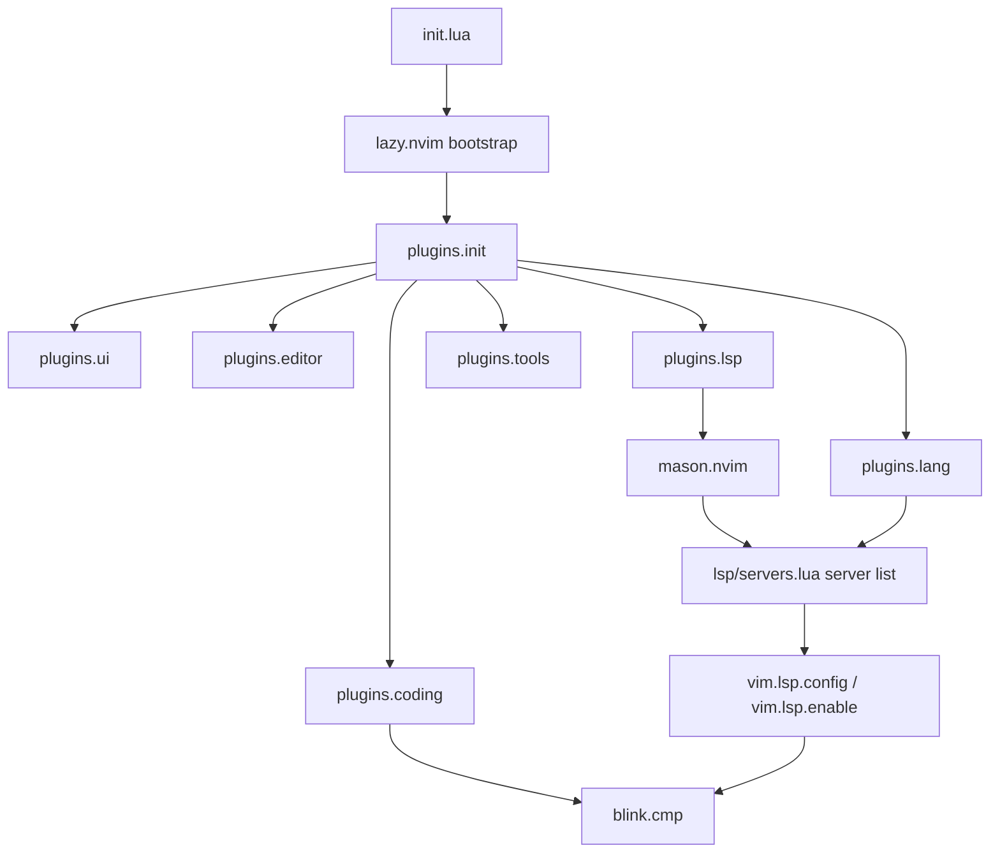

# Plugin Reference

Every plugin installed by this config, grouped the same way [`lua/plugins/`](../lua/plugins/) is organized on disk. Each entry links to its `lua/plugins/**/*.lua` spec and its upstream repo.

← Back to [README](../README.md)

---

## Table of Contents

- [Root-level (`plugins/init.lua`)](#root-level-pluginsinitlua)
- [UI (`plugins/ui/`)](#ui-pluginsui)
- [Editor (`plugins/editor/`)](#editor-pluginseditor)
- [Coding (`plugins/coding/`)](#coding-pluginscoding)
- [LSP (`plugins/lsp/`)](#lsp-pluginslsp)
- [Tools (`plugins/tools/`)](#tools-pluginstools)
- [Language extras (`plugins/lang/`)](#language-extras-pluginslang)

---

## Root-level ([`plugins/init.lua`](../lua/plugins/init.lua))

Small, self-contained plugins that don't warrant their own file.

| Plugin | What it does |
|---|---|
| [nvim-lua/plenary.nvim](https://github.com/nvim-lua/plenary.nvim) | Lua stdlib (async, paths, jobs) — dependency for Telescope-style pickers, Harpoon, Diffview, Gitsigns |
| [nvim-tree/nvim-web-devicons](https://github.com/nvim-tree/nvim-web-devicons) | Filetype icon set used by lualine, the file explorer, which-key, and more |
| [tfnico/vim-gradle](https://github.com/tfnico/vim-gradle) | Syntax highlighting for Gradle build files |
| [NoamFav/Zarya.nvim](https://github.com/NoamFav/Zarya.nvim) | Control and visualize Apple Music playback from inside Neovim |
| [jaxbot/semantic-highlight.vim](https://github.com/jaxbot/semantic-highlight.vim) | Colors each variable name consistently across a buffer; toggled with `<leader>s` |
| [weilbith/nvim-code-action-menu](https://github.com/weilbith/nvim-code-action-menu) | Floating preview menu for LSP code actions (`:CodeActionMenu`, `<leader>ca`) |
| [ellisonleao/glow.nvim](https://github.com/ellisonleao/glow.nvim) | Renders Markdown in a floating preview via `glow` (`:Glow`) |
| [OXY2DEV/markview.nvim](https://github.com/OXY2Dev/markview.nvim) | Live in-buffer Markdown rendering (headings, tables, code blocks, checkboxes) without leaving the editor |
| [folke/todo-comments.nvim](https://github.com/folke/todo-comments.nvim) | Highlights and lets you search `TODO`/`FIXME`/`HACK`/`NOTE` comments across the project |
| [preservim/tagbar](https://github.com/preservim/tagbar) | Sidebar outline of tags (functions, classes, etc.) for the current file — needs [Universal Ctags](https://github.com/universal-ctags/ctags) on `$PATH` |

---

## UI ([`plugins/ui/`](../lua/plugins/ui/))

| Plugin | What it does |
|---|---|
| [folke/tokyonight.nvim](https://github.com/folke/tokyonight.nvim) | Default colorscheme (`night` style), loaded eagerly at startup |
| [catppuccin/nvim](https://github.com/catppuccin/nvim) | Pastel colorscheme, auto-switches latte/mocha with background |
| [scottmckendry/cyberdream.nvim](https://github.com/scottmckendry/cyberdream.nvim) | High-contrast cyberpunk-styled colorscheme |
| [navarasu/onedark.nvim](https://github.com/navarasu/onedark.nvim) | Atom One Dark colorscheme port |
| [sainnhe/sonokai](https://github.com/sainnhe/sonokai) | High-contrast, vivid colorscheme |
| [NoamFav/2077.nvim](https://github.com/NoamFav/2077.nvim) | A cyberpunk-themed colorscheme |
| [folke/snacks.nvim](https://github.com/folke/snacks.nvim) | The Swiss-army-knife plugin: fuzzy picker, file explorer, dashboard, notifier, LazyGit launcher, scratch buffers, big-file handling, and more — see [Key Mappings](../README.md#key-mappings) for the full command surface |
| [nvim-lualine/lualine.nvim](https://github.com/nvim-lualine/lualine.nvim) | Statusline + tabline/bufferline, theme-aware |
| [j-hui/fidget.nvim](https://github.com/j-hui/fidget.nvim) | LSP progress spinners and a notification history window (also overrides `vim.notify`) |
| [nvim-tree/nvim-web-devicons](https://github.com/nvim-tree/nvim-web-devicons) | (configured again here with custom overrides, e.g. a distinct `.env` icon) |
| [echasnovski/mini.icons](https://github.com/echasnovski/mini.icons) | Secondary icon provider some plugins fall back to |
| [NvChad/nvim-colorizer.lua](https://github.com/NvChad/nvim-colorizer.lua) | Highlights color codes (`#rrggbb`, Tailwind classes, etc.) with their actual color |

---

## Editor ([`plugins/editor/`](../lua/plugins/editor/))

| Plugin | What it does |
|---|---|
| [nvim-treesitter/nvim-treesitter](https://github.com/nvim-treesitter/nvim-treesitter) (`main` branch) | Incremental parsing for syntax highlighting, indentation, and folding; parsers installed via `:TSUpdate` |
| [nvim-treesitter/nvim-treesitter-context](https://github.com/nvim-treesitter/nvim-treesitter-context) | Sticky header showing the enclosing function/loop/if while scrolling (`<leader>uk` to toggle) |
| [HiPhish/rainbow-delimiters.nvim](https://github.com/HiPhish/rainbow-delimiters.nvim) | Color-codes matching brackets/parens by nesting depth |
| [ThePrimeagen/harpoon](https://github.com/ThePrimeagen/harpoon) (v1) | Pin up to 4 files and jump between them instantly (`<leader>a`, `<leader>1-4`) |
| [windwp/nvim-autopairs](https://github.com/windwp/nvim-autopairs) | Auto-closes brackets/quotes as you type |
| [Pocco81/auto-save.nvim](https://github.com/Pocco81/auto-save.nvim) | Saves the buffer automatically on `InsertLeave`/`TextChanged`/`BufLeave` |
| [numToStr/Comment.nvim](https://github.com/numToStr/Comment.nvim) | Toggle line/block comments (`gcc`, `gc`, `gbc`, `gb`) |

---

## Coding ([`plugins/coding/`](../lua/plugins/coding/))

| Plugin | What it does |
|---|---|
| [saghen/blink.cmp](https://github.com/saghen/blink.cmp) | The completion engine — LSP, path, snippet, buffer, emoji, and dictionary sources, all scored and merged |
| [moyiz/blink-emoji.nvim](https://github.com/moyiz/blink-emoji.nvim) | Emoji completion source for blink.cmp |
| [Kaiser-Yang/blink-cmp-dictionary](https://github.com/Kaiser-Yang/blink-cmp-dictionary) | Dictionary/word-list completion source for blink.cmp (needs `fzf`; see [Requirements](../README.md#requirements)) |
| [L3MON4D3/LuaSnip](https://github.com/L3MON4D3/LuaSnip) | Snippet engine that powers blink.cmp's `snippets` source |
| [rafamadriz/friendly-snippets](https://github.com/rafamadriz/friendly-snippets) | A large pre-built VS Code-style snippet collection, loaded lazily by LuaSnip |

---

## LSP ([`plugins/lsp/`](../lua/plugins/lsp/))

| Plugin | What it does |
|---|---|
| [neovim/nvim-lspconfig](https://github.com/neovim/nvim-lspconfig) | Only used for its `capabilities`/`on_attach` wildcard config here — actual server definitions live in [`lua/lsp/servers.lua`](../lua/lsp/servers.lua), not this plugin's server tables |
| [williamboman/mason.nvim](https://github.com/williamboman/mason.nvim) | Package manager for LSP servers, formatters, linters (`:Mason`) |
| [williamboman/mason-lspconfig.nvim](https://github.com/williamboman/mason-lspconfig.nvim) | Bridges Mason installs to `vim.lsp.enable()`, auto-installing everything in `lsp.servers.get_server_list()` |
| [Hoffs/omnisharp-extended-lsp.nvim](https://github.com/Hoffs/omnisharp-extended-lsp.nvim) | Better go-to-definition for OmniSharp (decompiles external assemblies instead of failing) |
| [nvimdev/lspsaga.nvim](https://github.com/nvimdev/lspsaga.nvim) | Prettier floating UI for hover docs, rename, and other LSP actions |
| [WhoIsSethDaniel/mason-tool-installer.nvim](https://github.com/WhoIsSethDaniel/mason-tool-installer.nvim) | Auto-installs the formatter binaries (`prettierd`, `black`, `stylua`, `gofumpt`, …) listed in [`formatters.lua`](../lua/plugins/lsp/formatters.lua) |
| [nvimtools/none-ls.nvim](https://github.com/nvimtools/none-ls.nvim) (+ [none-ls-extras.nvim](https://github.com/nvimtools/none-ls-extras.nvim)) | Runs external linters as LSP diagnostics — currently just `flake8` for Python |
| [mhartington/formatter.nvim](https://github.com/mhartington/formatter.nvim) | Per-filetype formatter dispatch (`<leader>df` / format-on-save) — see the full exe list in [`formatters.lua`](../lua/plugins/lsp/formatters.lua) |
| [Diogo-ss/42-header.nvim](https://github.com/Diogo-ss/42-header.nvim) | Stamps/updates the 42 School standard header comment (`<F1>`, `:Stdheader`) |
| [hardyrafael17/norminette42.nvim](https://github.com/hardyrafael17/norminette42.nvim) | Runs the 42 School `norminette` linter on save for `.c`/`.h` files |

---

## Tools ([`plugins/tools/`](../lua/plugins/tools/))

| Plugin | What it does |
|---|---|
| [f-person/git-blame.nvim](https://github.com/f-person/git-blame.nvim) | Inline virtual-text blame for the current line |
| [sindrets/diffview.nvim](https://github.com/sindrets/diffview.nvim) | Side-by-side diff views and file-history browsing (`:DiffviewOpen`) |
| [lewis6991/gitsigns.nvim](https://github.com/lewis6991/gitsigns.nvim) | Git change markers in the sign column (add/change/delete hunks) |
| [akinsho/git-conflict.nvim](https://github.com/akinsho/git-conflict.nvim) | Highlights and gives keymaps for resolving merge conflicts in-buffer |
| [akinsho/toggleterm.nvim](https://github.com/akinsho/toggleterm.nvim) | Floating/managed terminal windows (`<C-t>`) |
| [folke/trouble.nvim](https://github.com/folke/trouble.nvim) | Persistent, pinnable list views for diagnostics, LSP references/symbols, quickfix, and loclist |
| [folke/which-key.nvim](https://github.com/folke/which-key.nvim) | Popup showing available keymaps as you type a prefix; also defines the `<leader>{b,c,d,f,g,l,m,n,t,x}` group labels |

---

## Language extras ([`plugins/lang/`](../lua/plugins/lang/))

These sit **on top of** the LSP servers defined in [`lua/lsp/servers.lua`](../lua/lsp/servers.lua) — they add tooling, not the language server itself.

| Plugin | What it does |
|---|---|
| [ray-x/go.nvim](https://github.com/ray-x/go.nvim) (+ [guihua.lua](https://github.com/ray-x/guihua.lua)) | Go tooling: `:GoRun`, `:GoTest*`, coverage overlay, `:GoAddTag`/`:GoRmTag`, `:GoIfErr`, `:GoFillStruct`, `:GoImpl`; installs `gomodifytags`/`gotests`/`iferr`/`impl`/`dlv` on build. `gopls` itself stays owned by `servers.lua` (`lsp_cfg = false`) |
| [mfussenegger/nvim-jdtls](https://github.com/mfussenegger/nvim-jdtls) | Java-specific extensions on top of `jdtls` |
| [p00f/clangd_extensions.nvim](https://github.com/p00f/clangd_extensions.nvim) | C/C++ inlay hints (param names/types) and an AST viewer, built on `clangd` |
| [m-demare/hlargs.nvim](https://github.com/m-demare/hlargs.nvim) | Colors function parameters consistently across C/C++, Go, Rust, Lua, Python, JS/TS, Java, and more |
| [maxmellon/vim-jsx-pretty](https://github.com/maxmellon/vim-jsx-pretty) | JSX/TSX syntax highlighting |
| [luckasRanarison/tailwind-tools.nvim](https://github.com/luckasRanarison/tailwind-tools.nvim) | Tailwind CSS class previews/tools for HTML/CSS/JS/TS |
| [lervag/vimtex](https://github.com/lervag/vimtex) | LaTeX compilation (via `latexmk`), viewing, and navigation |
| [daeyun/vim-matlab](https://github.com/daeyun/vim-matlab) | MATLAB syntax and filetype support |
| [3rd/image.nvim](https://github.com/3rd/image.nvim) | Renders images inline in the buffer via the Kitty graphics protocol |
| [benlubas/molten-nvim](https://github.com/benlubas/molten-nvim) | Jupyter kernel integration — run cells, see plots/output inline via `image.nvim` |

---

## Full dependency graph (Mermaid)

